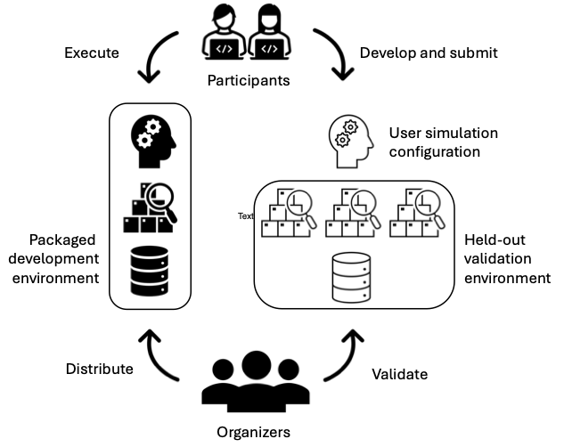

## tl;dr

Interactive and engaging Workshop on Simulations for Information Access at [SIGIR 2025](https://sigir2025.dei.unipd.it/) in Padua, Italy. 

## About

Simulations in information access (IA) have recently gained interest, as shown by various tutorials and workshops around that topic. 
Simulations can be key contributors to central IA research and evaluation questions, especially around interactive settings when real users are unavailable, or their participation is impossible due to ethical reasons. In addition, simulations in IA can help contribute to a better understanding of users, reduce complexity of evaluation experiments, and improve reproducibility. 

Building on recent developments in methods and toolkits, the second iteration of our [last year's Sim4IA workshop](../sigir2024) aims to again bring together researchers and practitioners to form an interactive and engaging forum for discussions on the field's future perspectives. An additional aim is to plan an upcoming TREC/CLEF campaign.

## Workshop Goals

To understand how and whether the evaluation of information access technology can truly benefit from simulating user interactions, not only tools and frameworks are critical, but a multidisciplinary discussion and mutual understanding among the broad and sometimes conflicting perspectives is necessary. Simulations have to be aligned to the real-world settings of users and their complex information needs, contexts, and requirements. This workshop should serve as a forum to bring together researchers and practitioners. Additionally, this workshop aims to provide a much-needed forum for the community to discuss the emerging challenges when applying (user) simulations to evaluate information access systems in simulation-based shared tasks. Our goals are to:

* Continue our series of workshops to generate an open conversation about possible future scenarios, applications, and methods to include simulations in the evaluation of IA systems;
* Provide a forum at SIGIR to discuss the pressing and emerging issues the IR community faces, and how simulations can help to overcome these;
* Develop and advertise the idea of organizing a TREC/CLEF campaign that includes simulations as a core element;
* Test an initial setting for two (micro) shared tasks designed around two IA use cases that might form the basis for the aforementioned TREC/CLEF campaign.

## Micro Shared Task

With this year’s workshop, we intend to define a shared task for TREC/CLEF on the basis of two micro shared tasks which we will tackle in Sim4IA.

Our anticipated shared task concept is based on the fundamental
design principle of validating user simulations instead of measuring system effectiveness. That is, we envision users interacting with a particular IA system, such as a traditional search engine (Task A) or a conversational system (Task B), and challenge participants to design and implement user simulators that can mimic the interactions of real users with these systems with a high degree of fidelity.
The workshop features a stripped-down version of this concept,
which we deem micro shared tasks.

The following figure illustrates the general setting where participants focus on developing user simulators. To lower the barrier to entry and allow participants to focus on the more (scientifically) interesting aspects of the task as opposed to system engineering, we provide them with data, baseline systems, and baseline user configurations packaged in a dockerized environment. Specifically, we plan to employ the [SimIIR simulation framework](https://github.com/simint-ai/simiir-3). 



### Overview

The primary goal of the micro shared tasks is to provide a starting point to work towards a large-scale evaluation campaign and to gain first-hand, practical experiences that are useful for the organisation of such a campaign. We feature two tasks that follow the same high-level structure: given a sequence of user interactions with an information access system as input, simulate (i.e., predict) the next action the user would take, such as the next query. Evaluation of the simulation approaches will then be based on comparing the predicted user actions against the real actions in historical interaction logs and the impact on the system’s outcome. We provide an easy-to-use and lightweight framework to conduct hands-on user simulations based on the latest version (v3) of the SimIIR framework. The datasets used are based on samples of log data from the CORE platform and the corresponding LongEval collection. 

Participants are asked to submit two things:
- A SimIIR-compatible implementation of their user simulations ([Task A](#task-a), [Task B](#task-b))
- A short lab note describing the submission

The workshop will discuss the submissions and ideas for the next steps or evaluation measures.

Non-binding expression of interest to take part in the micro shared tasks (please submit by 1st May): [Google Form](https://forms.gle/ftV8cwjywHWsBhCw9)

### Task A

Task A focuses on simulating users’ query behaviour in an interactive retrieval task. The objective is to develop user agents that align well with the query variations over sessions derived from the provided CORE log files. We will provide participants with an initial query, a corresponding BM25-based SERP, and some user interactions with this SERP. From there, participants should try to predict the following query formulated by the user. We will evaluate the predicted queries by comparing them with the real following queries using different comparison strategies. 

### Task B 
Task B focuses on simulating user utterances in a conversational search setting. Given a sequence of conversational utterances between a user and a system, where the last utterance was from the system, the task is to simulate the next user utterance. The conversational data used for this task is generated synthetically based on traditional search logs. Evaluation will be performed based on the semantic similarity of the predicted vs. actual user utterances.

### Data Set and SimIIR Package

Both tasks are based on a newly created dataset from the [LongEval 2025 lab at CLEF](https://clef-longeval.github.io/), derived from interaction data collected on the [CORE platform](https://core.ac.uk). Participants will receive a set of user sessions extracted from log files, consisting of two key components: search and click information. The provided dataset will contain sessions that were mapped and gathered from the given CORE log file.

```
# Search query and returned results
{ 
  "search_id": "e5385afdaedcc11f9a6ba092cb613f27", 
  "query": "inclusive codesign",
  "serp": [
    "https://core.ac.uk/works/156973302",
    "https://core.ac.uk/works/8080300",
    "https://core.ac.uk/works/45177790",
    "https://core.ac.uk/works/148924361",
    "https://core.ac.uk/works/149405922",
    "https://core.ac.uk/works/149554048",
    "https://core.ac.uk/works/15034633",
    "https://core.ac.uk/works/150382029",
  ],
  "date": "2024-12-03T07:11:11.000Z"
}
# unique click information
{ 
  "search_id": "e5385afdaedcc11f9a6ba092cb613f27", 
  "url": "https://core.ac.uk/works/156973302",
  "serp": "0", 
  "date": "2024-12-03T07:11:11.000Z" 
}
```

Both tasks are closely aligned with the design of the recently released SimIIR 3 framework. SimIIR 3 enables the simulation of both conversational users and users in traditional ad hoc retrieval systems, providing the advantage of operating within a unified ecosystem rather than relying on multiple frameworks. With its latest version, SimIIR now supports large language models (LLMs) for all existing user actions. However, participants are also encouraged to explore alternative methods, such as sophisticated rule-based or probabilistic approaches, as valid submissions for the workshop.

The training dataset will be included in a dockerized fork of the SimIIR GitHub repository, which will automatically download and install all necessary dependencies and datasets to ensure lightweight and convenient access for experiments. Additionally, we will provide guidelines to help participants get started quickly with the framework.

### Submissions - Simulators and Lab Papers

In the final step, participants will submit the adapted repository containing their approach in a Zenodo community. The evaluation will be conducted on the test dataset that will be published on 13rd June to assess how well the simulated interactions align with real user behavior and to what extent the approach generalizes to these sessions.

We encourage all participants of the micro shared tasks to summarize their simulation approach and concepts or ideas for evaluation in a short lab paper. These papers are to be submitted via EasyChair and will be editorially reviewed. We will share these papers with all other participants. More information on the lab papers follows.

## Dates

- 16th May 2025: Release of the training dataset and Docker SimIIR package
- 13rd June 2025: Release of the test dataset
- 27th June 2025: Submission deadline for simulation configurations from participants
- 4th July 2025: Submission deadline for Lab Notes
- 17th July 2025: Workshop at SIGIR in Padua, Italy


## Organizers

* [Philipp Schaer](https://ir.web.th-koeln.de/people/philipp-schaer/), TH Köln – University of Applied Sciences, Germany
* [Christin Kreutz](https://kreutzch.github.io/), TH Mittelhessen, Gießen, Germany
* [Krisztian Balog](https://krisztianbalog.com/), University of Stavanger, Norway
* [Timo Breuer](https://ir.web.th-koeln.de/people/timo-breuer/), TH Köln – University of Applied Sciences, Germany
* [Andreas Kruff](https://ir.web.th-koeln.de/people/andreas-kruff/), TH Köln – University of Applied Sciences, Germany

