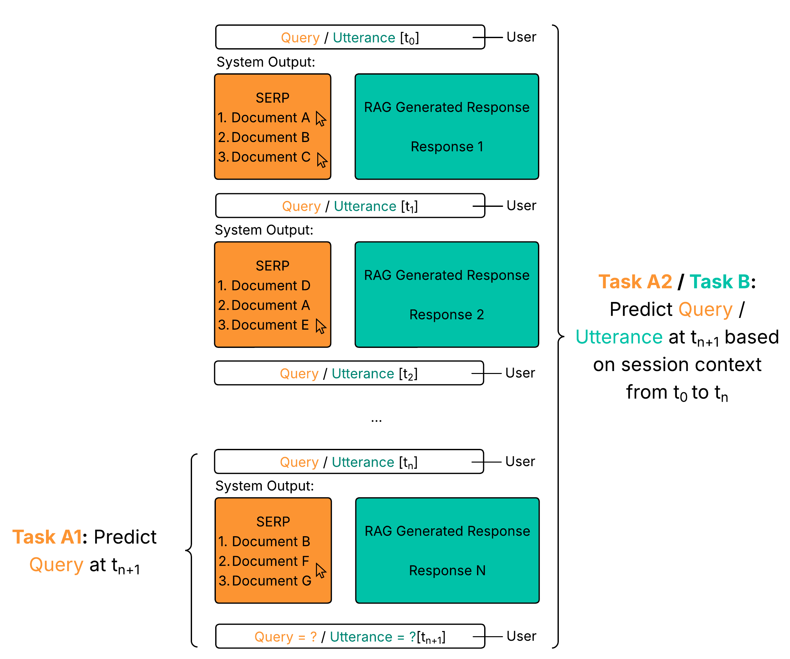

## tl;dr

Interactive and engaging Workshop on Simulations for Information Access at [SIGIR 2025](https://sigir2025.dei.unipd.it/) in Padua, Italy. 

## Updates
- 16 May 2025: We released the **[training data and the dockerized simulation environment](https://github.com/sim4ia/sigir2025-shared-task)**! Check it out. More [information on the micro shared task](#micro-shared-task) is available.
- 15 April 2025: Join the Sim4IA workshop at the **[ACM SIGIR Slack](http://acmsigir.slack.com)** on #sigir2025-sim4ai-workshop! Contact the organizers if you need an invite.

## About

Simulations in information access (IA) have recently gained interest, as shown by various tutorials and workshops around that topic. 
Simulations can be key contributors to central IA research and evaluation questions, especially around interactive settings when real users are unavailable, or their participation is impossible due to ethical reasons. In addition, simulations in IA can help contribute to a better understanding of users, reduce complexity of evaluation experiments, and improve reproducibility. 

Building on recent developments in methods and toolkits, the second iteration of our [last year's Sim4IA workshop](../sigir2024) aims to again bring together researchers and practitioners to form an interactive and engaging forum for discussions on the field's future perspectives. An additional aim is to plan an upcoming TREC/CLEF campaign.

## Workshop Goals

To understand how and whether the evaluation of information access technology can truly benefit from simulating user interactions, not only tools and frameworks are critical, but a multidisciplinary discussion and mutual understanding among the broad and sometimes conflicting perspectives is necessary. Simulations have to be aligned to the real-world settings of users and their complex information needs, contexts, and requirements. This workshop should serve as a forum to bring together researchers and practitioners. Additionally, this workshop aims to provide a much-needed forum for the community to discuss the emerging challenges when applying (user) simulations to evaluate information access systems in simulation-based shared tasks. Our goals are to:

* Continue our series of workshops to generate an open conversation about possible future scenarios, applications, and methods to include simulations in the evaluation of IA systems;
* Provide a forum at SIGIR to discuss the pressing and emerging issues the IR community faces, and how simulations can help to overcome these;
* Develop and advertise the idea of organizing a TREC/CLEF campaign that includes simulations as a core element;
* Test an initial setting for two (micro) shared tasks designed around two IA use cases that might form the basis for the aforementioned TREC/CLEF campaign.

## Micro Shared Task
Our shared task concept is based on the fundamental design principle of validating user simulations instead of measuring system effectiveness. We envision users interacting with a particular IA system, such as a traditional search engine (Task A) or a conversational system (Task B). We challenge participants to design and implement user simulators that can mimic the interactions of real users with these systems with a high degree of fidelity.
The workshop features a stripped-down version of this concept, a micro shared task.

We will discuss the submissions and ideas for the next steps or evaluation measures at the workshop. Non-binding expression of interest to take part in the micro shared tasks: [Google Form](https://forms.gle/ftV8cwjywHWsBhCw9)

### Tasks
The following figure illustrates the general setting. 



#### Task A1 and A2
Task A focuses on simulating users’ query behaviour in an interactive retrieval task. The objective is to develop user agents that align well with the query variations over sessions derived from the provided CORE log files. We will provide participants with an initial query, a corresponding SERP from CORE platform, and some user interactions with this SERP. From there, participants should try to predict the following query formulated by the user. We will evaluate the predicted queries by comparing them with the real following queries using different comparison strategies. 

The tasks are the following:

- **Task A1 - Next query prediction**: The participants get one initial query/SERPs/click set from timestamp t_n and have to predict the following query at t_n+1.
- **Task A2 - Session-based next query prediction**: The participants get the same data as in task A1, but not only one but n different queries, SERPs, and corresponding clicks. The task is now to predict the following query at t_n+1.

The data for tasks A1 and A2 look like this:
```
1,test_user,1,cultural female genital mutilation,2025-01-10 20:55:48,"[49700987, 41108296, 70340641, 8872149, 151014331, 68561928, 122589791, 126475067, 70353000, 163079162]",4c17b92490816aea96cbcc112f222913,"[('122589791', datetime.datetime(2025, 1, 10, 20, 56, 10), 'works')]"
2,test_user,1,cultural female genital mutilation egypt,2025-01-10 20:57:03,"[107753778, 134385557, 134967534, 31315918, 15106563, 46676819, 45507658, 34140770, 62051567, 46753109]",de73be5d8bf71a6bc877615ebb29b447,"[('15106563', datetime.datetime(2025, 1, 10, 20, 57, 26), 'works')]"
3,test_user,1, ...
```

#### Task B 
Task B focuses on simulating user utterances in a conversational search setting. Given a sequence of conversational utterances between a user and a system, where the last utterance was from the system, the task is to simulate the next user utterance. The conversational data used for this task is generated synthetically based on traditional search logs. Evaluation will be performed based on the semantic similarity of the predicted vs. actual user utterances.

The data for task B looks like this:
```
{
  "1": {
    "1": {
      "query": "The effects of Extracurricular Activities in High School ",      
      "response": "Participation in extracurricular activities appears to have a positive effect on the academic achievement of high school students. A study at Flora High School found that students felt extracurriculars impacted their academic performance, a belief supported by their cumulative grade point averages. The study recommends continued evaluation of these programs' value.\n\nAdditionally, research in Khoy, Iran, investigated the impact of Quranic extracurricular activities on the academic self-efficacy of female high school students. The findings suggest that such activities significantly influence students' academic self-efficacy, potentially promoting positive changes in attitudes and improved performance. Continued research into effective strategies is encouraged."
    },
    "2": {
      "query": "Key factors of stress among senior high school students",
      "response": "Several factors contribute to stress among senior high school students. Research indicates that senior pupils and university students of psychology experience higher levels of anxiety and dissatisfaction compared to others. Furthermore, colleges are actively exploring ways to support the mental health and emotional well-being of students aged 16-19, addressing both positive promotion and problem response. Techniques like Reiki and physical activities have shown to positively influence well-being, mood, and psychosomatic responses, offering potential avenues for stress mitigation within the senior high school population."
    },
    "3": { ...
```

### Data 
The datasets used are based on samples of log data from the [CORE scientific search platform](https://core.ac.uk/) and the corresponding [LongEval-Sci document collection](https://clef-longeval.github.io/data/). 

- **[Training data](https://github.com/sim4ia/sigir2025-shared-task)**: 45 search sessions (queries, SERPs, and clicks) for task A1 and A2; 45 conversations for task B.
- Test data to be released on 13th June 2025. In the test data, we will mask query t_n+1. 

### Simulation Framework
Both tasks are closely aligned with the design of the recently released [SimIIR 3 framework](https://github.com/simint-ai/simiir-3). SimIIR 3 enables the simulation of both conversational users and users in traditional ad hoc retrieval systems, providing the advantage of operating within a unified ecosystem rather than relying on multiple frameworks. With its latest version, SimIIR now supports large language models (LLMs) for all existing user actions. However, participants are also encouraged to explore alternative methods, such as sophisticated rule-based or probabilistic approaches, as valid submissions for the workshop.

To lower the barrier to entry and allow participants to focus on the more (scientifically) interesting aspects of the task as opposed to system engineering, we provide a 
- **[Pre-configured SimIIR simulation framework](https://github.com/sim4ia/sigir2025-shared-task)** packaged in a dockerized environment.

Participants can use their own simulation frameworks as well. 

### Submissions - Simulators and Lab Papers
In the final step, participants will submit the adapted repository containing their approach in a Zenodo community. The evaluation will be conducted on the test dataset that will be published on 13rd June to assess how well the simulated interactions align with real user behavior and to what extent the approach generalizes to these sessions.

We encourage all participants of the micro shared tasks to summarize their simulation approach and concepts or ideas for evaluation in a short lab paper. These papers are to be submitted via EasyChair and will be editorially reviewed. We will share these papers with all other participants. More information on the lab papers follows.

We therefore ask participants to submit the following:
- Top 10 predictions for the tasks A1, A2, and/or B. 
- A short lab note describing the submission
- A SimIIR-compatible implementation of their user simulations

## Dates

- 16th May 2025: Release of the training dataset and Docker SimIIR package
- 13rd June 2025: Release of the test dataset
- 27th June 2025: Submission deadline for simulation configurations from participants
- 4th July 2025: Submission deadline for Lab Notes
- 17th July 2025: Workshop at SIGIR in Padua, Italy

## Registration

The workshop will be in person. Every participant who would like to take part in the workshop must register via the official [SIGIR registration portal](https://sigir2025.dei.unipd.it/registration.html).

- Early registration deadline: May 20, 2025.
- Standard registration deadline: June 13, 2025.
- Late registration deadline: 18 July 2025.

We look forward to meeting you in Padua!

## Organizers

* [Philipp Schaer](https://ir.web.th-koeln.de/people/philipp-schaer/), TH Köln – University of Applied Sciences, Germany
* [Christin Kreutz](https://kreutzch.github.io/), TH Mittelhessen, Gießen, Germany
* [Krisztian Balog](https://krisztianbalog.com/), University of Stavanger, Norway
* [Timo Breuer](https://ir.web.th-koeln.de/people/timo-breuer/), TH Köln – University of Applied Sciences, Germany
* [Andreas Kruff](https://ir.web.th-koeln.de/people/andreas-kruff/), TH Köln – University of Applied Sciences, Germany

